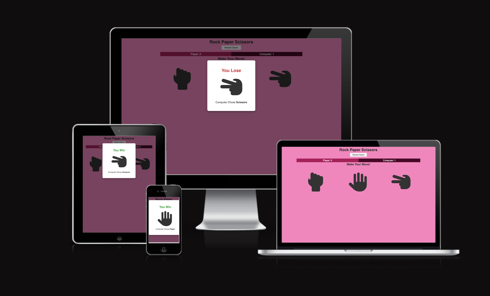

# Rock Paper Scissors 

A simple game of Rock, Paper, Scissors using HTML, CSS and JavaScript.

[View Live Site]( https://chloekeenan.github.io/Project-2/)

   

# Current Features
**Header**
- The 'Rock Paper Scissors' header sits at the top of the page and shows the name of the game in a minimalistic font.
 
**Game Interface**
- The game interface displays three different icons to choose from which are rock, paper and scissors.

- When the user touches an icon, it turns a darkk purple, indicating that it can be clicked on. 

- When clicked, the game result will be shown immediately. It will be either a Win, Lose or Draw.

**Game Results**
- The scores are recorded in the two score boxes, which are clearly designated in an outline color that corresponds to the game field's icon colors.

# Future Features

- I'd like to add a multiplayer mode to the game, so the user can play against either a human or a machine.

# Testing 

- Chrome Developer Tools to test the responsiveness of pages The site was tested on Safari, a desktop computer, an iPad, and an iphone 12.

- No icons are pixelated or stretched on the website, which is responsive on all screen sizes. Nothing overlaps.

# Validation Testing

- HTML: When running through the official W3C validator, no issues were reported.
[HTML Validator](https://validator.w3.org/nu/#textarea)

- CSS: When running through the official W3C validator, no issues were reported. 
[CSS Validator](https://jigsaw.w3.org/css-validator/validator?uri=https%3A%2F%2Fchloekeenan.github.io%2FProject-2%2F&profile=css3svg&usermedium=all&warning=1&vextwarning=&lang=en)

- JavaScript: JavaScript was tested using (https://jshint.com/)

- Lighthouse: The results of testing the website using Lighthouse are listed below:

 

# Deployment 

- Github Pages was used to deploy the website. The following are the deployment steps:
- Find the Github repository "project-1" after signing in to Github.
- Select "Settings" from the drop-down menu at the repository's top.
- On the left-hand side navigation menu, select "Pages."
- If it is not already selected, choose "Deploy from a branch" under "Source".
- Choose "main" and "root" from the drop-down choices underneath "Branch."
Select "Save"
- he live link should display beneath the heading "Github Pages" once the page has refreshed.

You can view the link here: (https://chloekeenan.github.io/Project-2/)

# User Goals 
**As a user I want to:**
- The aim of the game is that Rock wins over scissors, scissors win over paper, and paper wins over rock. The goal is to play an item that outperforms the item chosen at random by the computer.

# Target Audience 
**Key Demographics**

- Age 12-25 

- 50% Female 50% Male 

# Credits 

- Rock Paper Scissors Game - UI & JavaScript (https://youtu.be/WR_pWXJZiRY) vide on Youtube was used to inspire me and help with the structure of the game.  

- (https://www.w3schools.com/) was used to help learn JavaScript and implement it into my project. 

- (https://codeinstitute.net/ie/) was used for inspiration for the project by following the Love Maths tutorial. 

- (https://www.w3schools.com/colors/colors_picker.asp) was used to find the HEC color code.

- The Book 'JavaScript for Dummies' by Chris Minnick and Eva Holland was used to learn the basics of JavaScript. 

- I would like to also credit the amazing tutors at The Code Institute for all of their help. 

# Media

- (https://pixabay.com/sound-effects/search/no/?manual_search=1&order=None)

- All icons used in the game were taken from Font Awesome (https://fontawesome.com/)